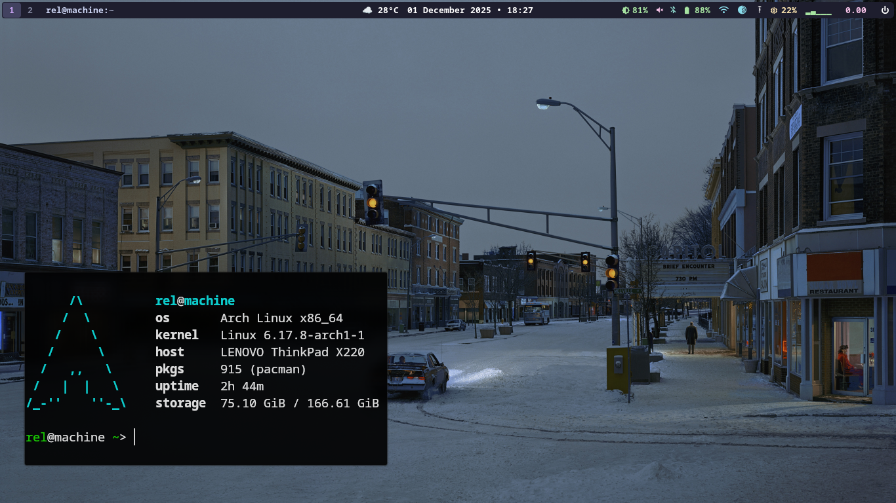

# hyprland-dotfiles
My personal Hyprland/Wayland config. Minimal, functional, and built for daily use.

## Screenshot

## Setup
1. Clone this repo to `~/.config/`.
2. Install [Hyprland](https://hyprland.org/) and required dependencies.
3. Relogin or restart your session.

## Notes
- **Waybar, Kitty, and Dunst** configs are included.
- **No cache or personal app data** is tracked (see `.gitignore`).

**License:** GPL-3.0. Use, modify, and share freely.

